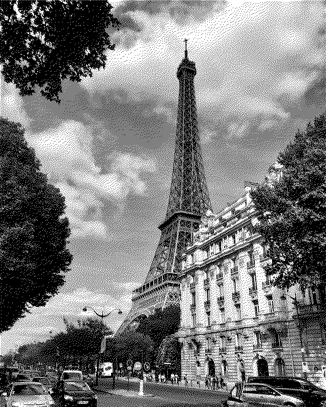
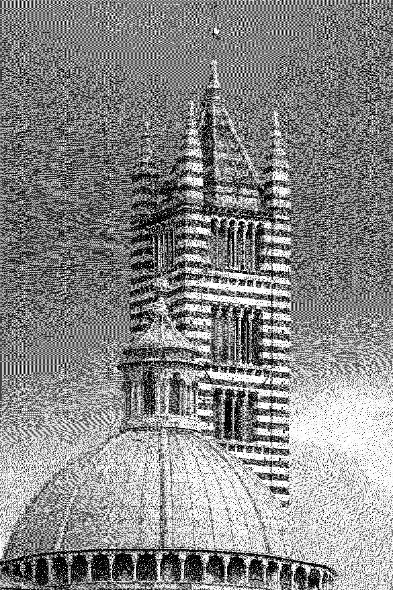

# Dithering

Floyd-Steinberg dithering algorithm C++ implementation.

## How to use

This program works as a console utility. In order to process image you need to supply a color palette and an image to the program:

```cmd
./dithering_app MyColors.json MyPicture.png
```

Color palette is a set of colors that the result image must consist of. Color palette format is JSON.

Here is example of black-white color palette:

```json
{
  "palette": [
    "000000",
    "ffffff"
  ]
}

```

You can find more examples of color palettes in "configs" folder.

## Image examples

Here is the original image:


Here is dithered image:



You can also dither multicolored image, not only grayscale. Original:


Dithered:



## Performance

## Supported formats

Images of PNG and JPEG formats are supported. Transparent images are not supported.

## Supported platforms

Program doesn't use any platform specific APIs, so it's crossplatform.

## License

This program and sources are distributed under the MIT licence.

Media resources used in this project are distributed under their respective license.

Unsplash license:
<https://unsplash.com/license>
